<!--
  ══════════════════════════════════════════════════════════════
  VIKAS RAWAT · GITHUB PROFILE README

  Every panel is a hand-written full-bleed dark SVG in /assets, so the page
  reads as one dark slab instead of cards floating on white.

  RESPONSIVE: each panel ships twice — assets/<name>.svg is the 1280-wide
  desktop original, assets/m/<name>.svg is a 480-wide portrait relayout.
  A <picture> serves the portrait one below 700px, so type lands at ~0.75x
  on a phone instead of ~0.28x. Edit the SVG source in /assets, not this file,
  and keep both variants in step.

  The live stat cards carry no width attribute on purpose: their intrinsic
  pixel width makes them sit two-up on a desktop README and reflow to one
  full-width column on a phone, with no media query needed.
  ══════════════════════════════════════════════════════════════
-->

  <picture>
    <source media="(max-width: 700px)" srcset="https://raw.githubusercontent.com/Vikas-rawat1/Vikas-rawat1/main/assets/m/hero.svg">
    
  </picture>

<a href="https://www.linkedin.com/in/vikas-rawat1/"><picture><source media="(max-width: 700px)" srcset="https://raw.githubusercontent.com/Vikas-rawat1/Vikas-rawat1/main/assets/m/link-1.svg">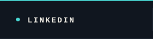</picture></a><a href="https://twitter.com/vikasrawat6565"><picture><source media="(max-width: 700px)" srcset="https://raw.githubusercontent.com/Vikas-rawat1/Vikas-rawat1/main/assets/m/link-2.svg">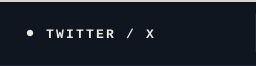</picture></a><a href="mailto:rawatvikas689@gmail.com"><picture><source media="(max-width: 700px)" srcset="https://raw.githubusercontent.com/Vikas-rawat1/Vikas-rawat1/main/assets/m/link-3.svg">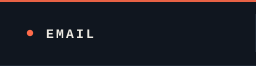</picture></a><a href="https://github.com/Vikas-rawat1?tab=repositories"><picture><source media="(max-width: 700px)" srcset="https://raw.githubusercontent.com/Vikas-rawat1/Vikas-rawat1/main/assets/m/link-4.svg">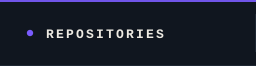</picture></a><a href="mailto:rawatvikas689@gmail.com"><picture><source media="(max-width: 700px)" srcset="https://raw.githubusercontent.com/Vikas-rawat1/Vikas-rawat1/main/assets/m/link-5.svg">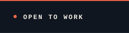</picture></a>

  <picture>
    <source media="(max-width: 700px)" srcset="https://raw.githubusercontent.com/Vikas-rawat1/Vikas-rawat1/main/assets/m/marquee.svg">
    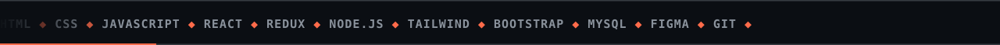
  </picture>

  <picture>
    <source media="(max-width: 700px)" srcset="https://raw.githubusercontent.com/Vikas-rawat1/Vikas-rawat1/main/assets/m/panel-about.svg">
    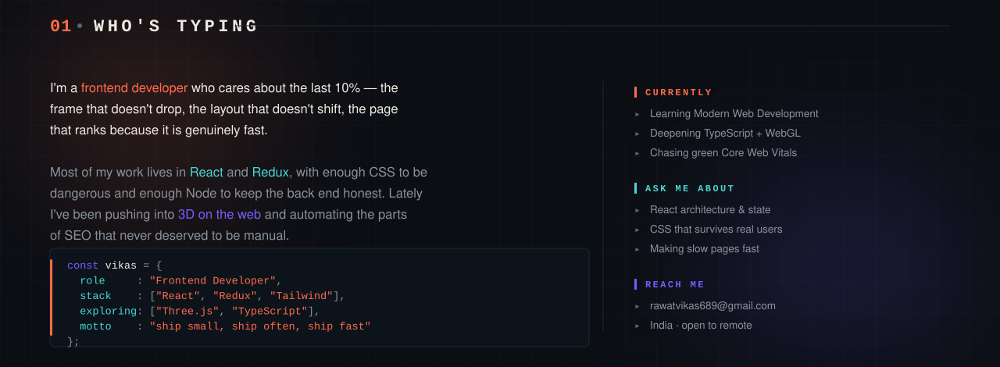
  </picture>

  <picture>
    <source media="(max-width: 700px)" srcset="https://raw.githubusercontent.com/Vikas-rawat1/Vikas-rawat1/main/assets/m/panel-stack.svg">
    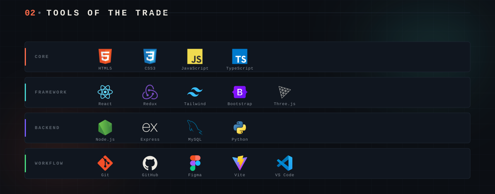
  </picture>

  <picture>
    <source media="(max-width: 700px)" srcset="https://raw.githubusercontent.com/Vikas-rawat1/Vikas-rawat1/main/assets/m/work-head.svg">
    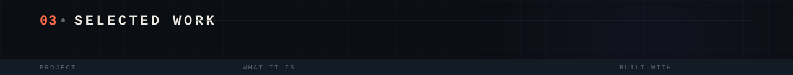
  </picture>
  <a href="https://github.com/Vikas-rawat1/daz3d-clone"><picture><source media="(max-width: 700px)" srcset="https://raw.githubusercontent.com/Vikas-rawat1/Vikas-rawat1/main/assets/m/work-1.svg">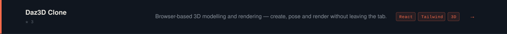</picture></a>
  <a href="https://github.com/Vikas-rawat1/cinecraze"><picture><source media="(max-width: 700px)" srcset="https://raw.githubusercontent.com/Vikas-rawat1/Vikas-rawat1/main/assets/m/work-2.svg">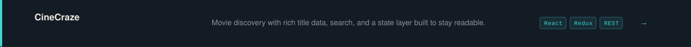</picture></a>
  <a href="https://github.com/Vikas-rawat1/Personal-Finance-Tracker"><picture><source media="(max-width: 700px)" srcset="https://raw.githubusercontent.com/Vikas-rawat1/Vikas-rawat1/main/assets/m/work-3.svg">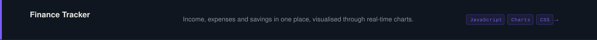</picture></a>
  <a href="https://github.com/Vikas-rawat1/Local-PC-Assistant"><picture><source media="(max-width: 700px)" srcset="https://raw.githubusercontent.com/Vikas-rawat1/Vikas-rawat1/main/assets/m/work-4.svg">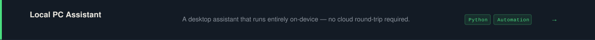</picture></a>
  <a href="https://github.com/Vikas-rawat1/claude-seo-skills"><picture><source media="(max-width: 700px)" srcset="https://raw.githubusercontent.com/Vikas-rawat1/Vikas-rawat1/main/assets/m/work-5.svg">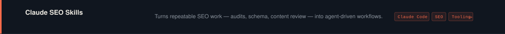</picture></a>
  <a href="https://github.com/Vikas-rawat1/Eduhub"><picture><source media="(max-width: 700px)" srcset="https://raw.githubusercontent.com/Vikas-rawat1/Vikas-rawat1/main/assets/m/work-6.svg">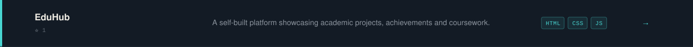</picture></a>
  <a href="https://github.com/Vikas-rawat1?tab=repositories"><picture><source media="(max-width: 700px)" srcset="https://raw.githubusercontent.com/Vikas-rawat1/Vikas-rawat1/main/assets/m/work-foot.svg">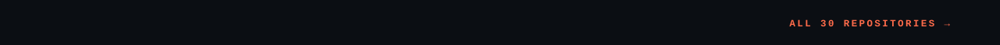</picture></a>

  <picture>
    <source media="(max-width: 700px)" srcset="https://raw.githubusercontent.com/Vikas-rawat1/Vikas-rawat1/main/assets/m/head-numbers.svg">
    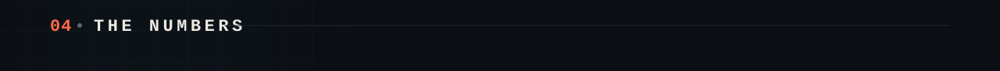
  </picture>

<picture><source media="(max-width: 700px)" srcset="https://github-readme-stats-salesp07.vercel.app/api?username=Vikas-rawat1&show_icons=true&hide_title=true&rank_icon=github&include_all_commits=true&hide_border=true&bg_color=0B0E13&text_color=EDEAE2&title_color=FF6B4A&icon_color=48D6D2&ring_color=FF6B4A&hide_rank=true&card_width=400"></picture><picture><source media="(max-width: 700px)" srcset="https://github-readme-stats-salesp07.vercel.app/api/top-langs/?username=Vikas-rawat1&layout=compact&langs_count=8&hide_border=true&bg_color=0B0E13&text_color=EDEAE2&title_color=FF6B4A&card_width=400"></picture>

<picture><source media="(max-width: 700px)" srcset="https://streak-stats.demolab.com?user=Vikas-rawat1&hide_border=true&background=0B0E13&stroke=222B36&ring=FF6B4A&fire=FF6B4A&currStreakNum=EDEAE2&currStreakLabel=FF6B4A&sideNums=EDEAE2&sideLabels=48D6D2&dates=8A929C&card_width=400"></picture><picture><source media="(max-width: 700px)" srcset="https://raw.githubusercontent.com/Vikas-rawat1/Vikas-rawat1/main/assets/m/panel-focus.svg">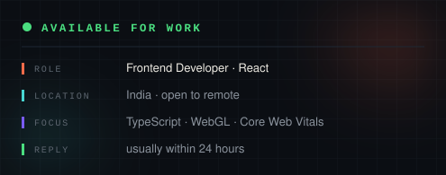</picture>

  <picture>
    <source media="(max-width: 700px)" srcset="https://raw.githubusercontent.com/Vikas-rawat1/Vikas-rawat1/main/assets/m/head-snake.svg">
    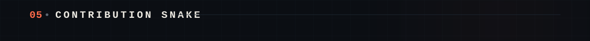
  </picture>

  <picture>
    <source media="(prefers-color-scheme: dark)"  srcset="https://raw.githubusercontent.com/Vikas-rawat1/Vikas-rawat1/output/snake-dark.svg">
    <source media="(prefers-color-scheme: light)" srcset="https://raw.githubusercontent.com/Vikas-rawat1/Vikas-rawat1/output/snake.svg">
    
  </picture>

  <picture>
    <source media="(max-width: 700px)" srcset="https://raw.githubusercontent.com/Vikas-rawat1/Vikas-rawat1/main/assets/m/panel-how.svg">
    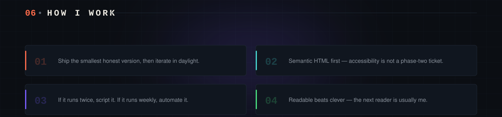
  </picture>

  <picture>
    <source media="(max-width: 700px)" srcset="https://raw.githubusercontent.com/Vikas-rawat1/Vikas-rawat1/main/assets/m/head-talk.svg">
    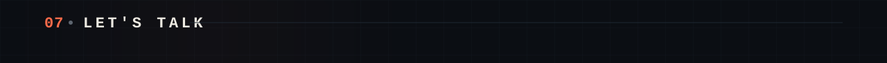
  </picture>

<a href="https://www.linkedin.com/in/vikas-rawat1/"><picture><source media="(max-width: 700px)" srcset="https://raw.githubusercontent.com/Vikas-rawat1/Vikas-rawat1/main/assets/m/link-1.svg"></picture></a><a href="https://twitter.com/vikasrawat6565"><picture><source media="(max-width: 700px)" srcset="https://raw.githubusercontent.com/Vikas-rawat1/Vikas-rawat1/main/assets/m/link-2.svg"></picture></a><a href="mailto:rawatvikas689@gmail.com"><picture><source media="(max-width: 700px)" srcset="https://raw.githubusercontent.com/Vikas-rawat1/Vikas-rawat1/main/assets/m/link-3.svg"></picture></a><a href="https://github.com/Vikas-rawat1?tab=repositories"><picture><source media="(max-width: 700px)" srcset="https://raw.githubusercontent.com/Vikas-rawat1/Vikas-rawat1/main/assets/m/link-4.svg"></picture></a><a href="mailto:rawatvikas689@gmail.com"><picture><source media="(max-width: 700px)" srcset="https://raw.githubusercontent.com/Vikas-rawat1/Vikas-rawat1/main/assets/m/link-5.svg"></picture></a>

  <picture>
    <source media="(max-width: 700px)" srcset="https://raw.githubusercontent.com/Vikas-rawat1/Vikas-rawat1/main/assets/m/footer.svg">
    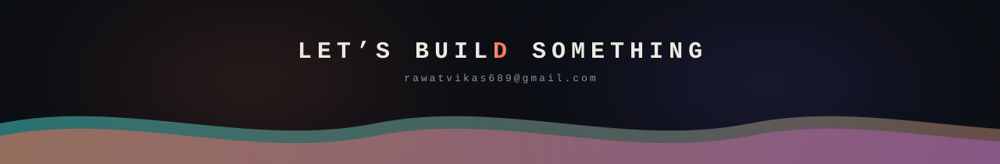
  </picture>

